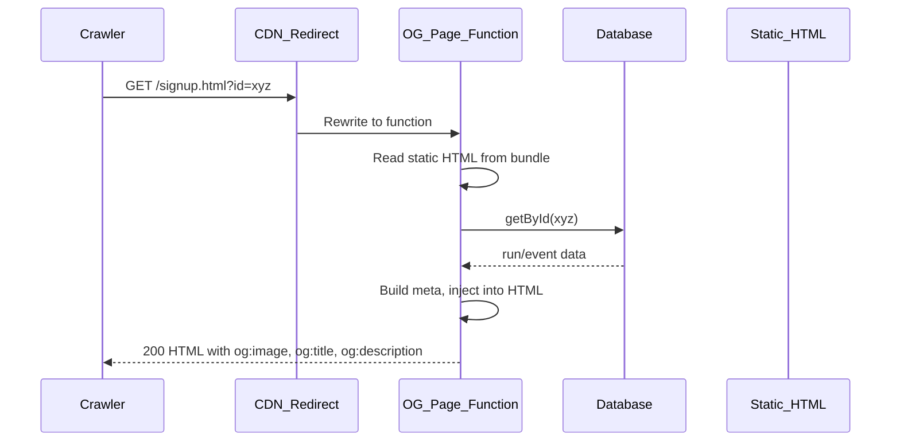

# Event Link Preview: Thumbnail and Description Implementation

This document describes how event-specific link previews (Open Graph thumbnail and description) are implemented so that crawlers (WhatsApp, Facebook, Twitter, iMessage, etc.) show the correct image and text when a user shares an event or signup URL. It is intended for agents or developers applying the same pattern to other applications.

---

## 1. Why server-side injection is required

**Problem:** Link-preview crawlers do not execute JavaScript. They issue a single HTTP GET, read the initial HTML, and use only the meta tags present in that response.

- If you set `og:image`, `og:title`, and `og:description` only in client-side JS after fetching event data, crawlers never see them.
- The crawler will use whatever is in the static HTML (often a default image and generic title/description).

**Solution:** The server (or a serverless function) must return HTML that already contains the correct Open Graph and Twitter Card meta for the requested event. When a request includes an event identifier (e.g. `?id=xyz`), the handler looks up the event, builds meta from that data, injects it into the page HTML, and returns the modified HTML.

---

## 2. High-level architecture

- **Redirect/rewrite:** All requests to the event/signup page URLs are rewritten (status 200) to a serverless function. Do not rely on query-parameter conditions for the rewrite; they are unreliable on some platforms (e.g. Netlify). Send every request for those paths to the function.
- **Function behavior:**
  - If no `id` (or equivalent) in the query: return the static HTML unchanged so the page still loads and client-side logic can show “event not found” or a generic state.
  - If `id` is present: load the event/run from the data store, build title/description/image URL, inject meta into the static HTML, return the modified HTML.
- **Static HTML source:** The function needs the raw HTML to inject into. To avoid redirect loops, do not fetch the same URL from the live site. Either bundle the static HTML with the function and read from the filesystem, or fetch from a different path that is not rewritten to the same function.

---

## 3. Thumbnail (image) logic

- **When the event has an image:** set `og:image` (and `twitter:image`) to an **absolute URL** that serves that event’s image. In this app that is:  
  `{origin}/api/event-image/{eventId}`  
  The event-image endpoint returns the image bytes (e.g. from DB or storage) with a proper `Content-Type` and cache headers so crawlers can fetch it.
- **When the event has no image:** set `og:image` and `twitter:image` to the **default thumbnail** used for the site (e.g. `{origin}/assets/images/og-default.jpeg`).

Requirements for the image URL:

- Must be absolute (include scheme and host).
- Must be publicly GET-table; crawlers will request it.
- Prefer a dedicated route (e.g. `/api/event-image/:id`) that returns the image with correct headers; avoid data URIs in meta tags.

---

## 4. Description and title format

**Title (event name):**

- Use the event’s display name only (e.g. “6ix Pickle - Pickleball & Pints”). Do not append a fixed suffix like “ - Gay Run Club” unless that is desired for the preview.
- Fallbacks when title is missing: e.g. “Run with {organizer}” or “Sign Up for Run”.

**Description (this app’s pattern):**

- Structure: `Join us!. Date: <date>. Location: <location>. Organized by: <organizer>. Event Status: <status>.`
- Build as a list of phrases and join with spaces. Omit any segment that has no data.
- Date: format in the event’s (or site’s) timezone, e.g. “Feb 3, 2026, 3:00 PM”.
- Location: full address or place name as stored.
- Organizer: display name of the planner/organizer.
- Status: human-readable (e.g. “Active”, “Cancelled”, “Completed”) derived from the event’s status field.

Example:  
`Join us!. Date: Feb 3, 2026, 3:00 PM. Location: 102 Berkeley Street, Toronto, Ontario, M5A 1N7, Canada. Organized by: Kerv. Event Status: Active.`

---

## 5. Implementation checklist for another application

1. **Identify the “event page” URLs** that should have dynamic previews (e.g. `/event.html`, `/signup.html`, or `/e/:id`).

2. **Ensure static HTML has injectable meta tags.** In the HTML, include:
   - `og:image`, `og:title`, `og:description`, `og:url`
   - `twitter:image`, `twitter:title`, `twitter:description`
   Use stable identifiers (e.g. `id="og-image"`) so the function can replace the `content` attribute with a regex or DOM-style replace.

3. **Add or reuse an “event image” endpoint** that:
   - Takes an event (or run) id.
   - Returns the event’s image with `Content-Type: image/jpeg` (or appropriate type) and cache headers.
   - Returns 404 (or equivalent) when the event has no image.

4. **Create a serverless function (e.g. `og-page`) that:**
   - Handles GET only.
   - Parses path and query (e.g. `id` or `eventId`).
   - Reads the static HTML for that page from the filesystem (or a safe non-rewritten URL).
   - If no id: returns the static HTML with 200.
   - If id present: loads the event from the database (or API), builds `{ title, description, ogImageUrl }` (and optionally `pageUrl`), injects them into the HTML, returns 200 with modified HTML.
   - On load error or “event not found”, return the static HTML (200) so the client can still render and show an error state; avoid returning 404 for the page itself if the app is a SPA or relies on client-side routing.

5. **Inject meta by replacing existing tags.** For each meta tag, replace the `content` attribute (and keep the same tag structure and ids). Example pattern:
   - Find: `<meta property="og:image" content="..." id="og-image">`
   - Replace with: `<meta property="og:image" content="{ogImageUrl}" id="og-image">`
   Escape values for HTML (e.g. `&`, `"`, `<`, `>`).

6. **Configure rewrites:** For the event/signup paths, add a rewrite (status 200) to the og-page function for **all** requests to that path (no query condition). This guarantees that crawlers requesting `https://yoursite.com/signup.html?id=xyz` hit the function.

7. **Bundle static HTML with the function** (recommended): Add the event/signup HTML files to the function’s included files so the function can read them from disk (e.g. `path.join(process.cwd(), 'signup.html')` or `path.join(__dirname, '..', '..', 'signup.html')`). This avoids the function calling back to the same URL and creating a loop.

8. **Optional: client-side parity.** Update client-side code that sets `og:image` / `og:title` / `og:description` (e.g. for tools that do run JS) to use the same title/description format and the same image URL rule (event image URL vs default thumbnail) so behavior is consistent.

---

## 6. Key files in this repository

| Purpose | Location |
|--------|----------|
| Serverless function that injects OG meta | `netlify/functions/og-page.js` |
| Serves event image by id | `netlify/functions/event-image.js` |
| Redirects: event/signup → function; event-image API | `netlify.toml` (redirects section) |
| Client-side OG update (signup page) | `assets/js/signup.js` (`updateOpenGraphTags`) |
| Client-side OG update (event page) | `assets/js/event.js` (in `loadEvent`, after picture block) |
| Static HTML with meta tags | `event.html`, `signup.html` (head section) |

---

## 7. Caching and rescraping

Crawlers and social platforms cache previews. After changing meta or deploying:

- Use the platform’s “refresh preview” or “rescrape” (e.g. Facebook Sharing Debugger, LinkedIn Post Inspector) to force a new fetch.
- Ensure `Cache-Control` on the function response is reasonable (e.g. short max-age for the HTML; longer for the default image and event-image API if desired).

---

## 8. Applying to another stack

- **Different host (e.g. Express, Vercel, Cloudflare):** Same idea: for the event/signup path, run a handler that (1) reads static HTML, (2) if `id` present loads event and builds meta, (3) injects meta and returns HTML. Use that host’s rewrite or middleware to send those paths to the handler.
- **Different event model:** Replace “run”/“event” with your entity; keep the rule “event has image → use event image URL, else use default thumbnail” and adopt or adapt the description format (Join us!. Date. Location. Organized by. Event Status.).
- **Multiple page types:** One function can branch on path (e.g. `/event`, `/signup`) and use different meta builders and static HTML files per type, as in `og-page.js` with `buildEventMeta` vs `buildSignupMeta`.
